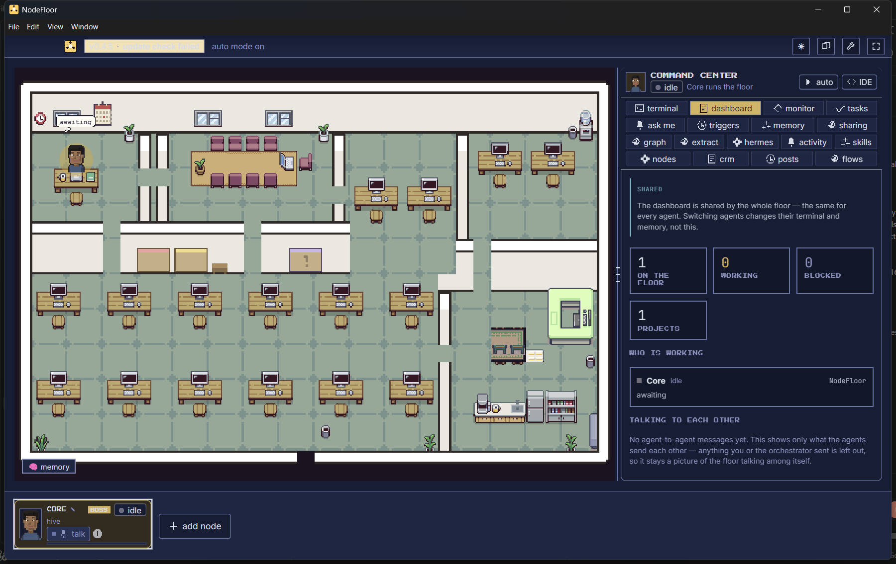
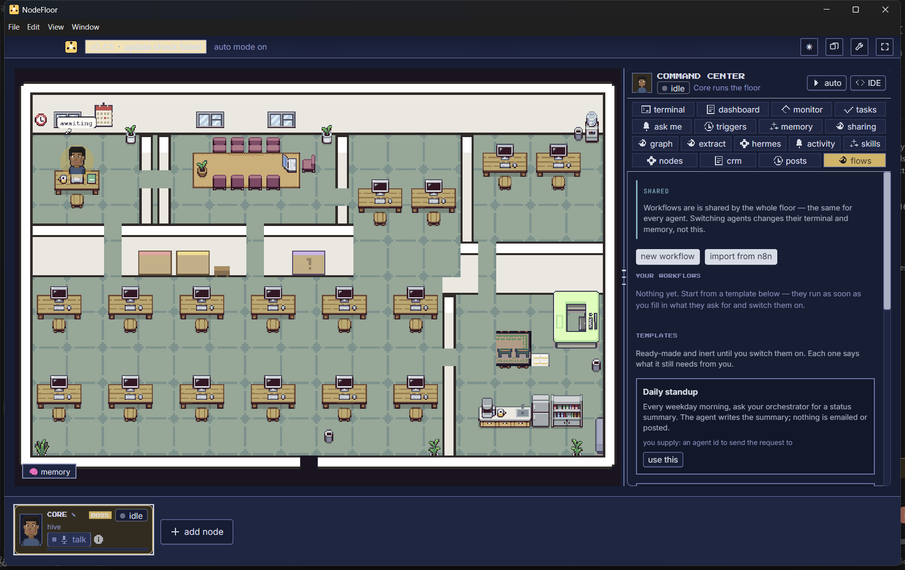
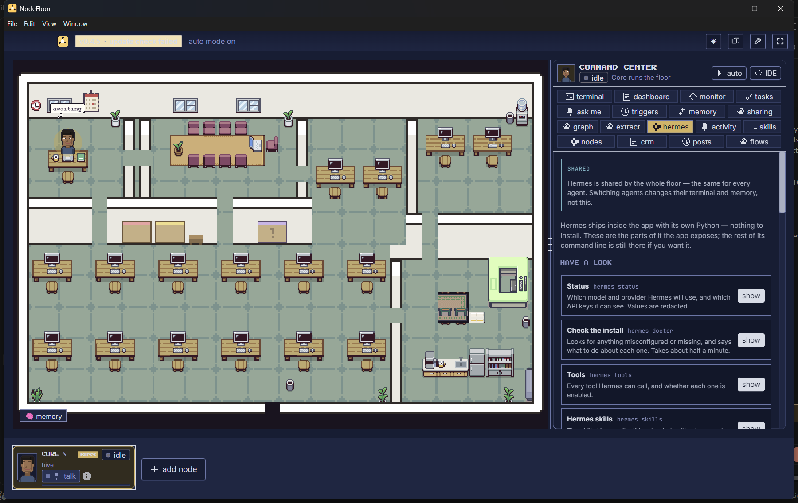

  

  A floor of AI agents that runs on your own machine, on the subscriptions you already have.

  <a href="https://github.com/OmorDeveloper/nodefloor-app/releases/latest"><b>Download</b></a> ·
  <a href="https://nodefloor.web.app">Website</a> ·
  <a href="#pricing">Pricing</a> ·
  <a href="docs/how-it-works.md">How it works</a>

---

This repository is the **download and documentation home** for NodeFloor. The
application source is not here and is not public — see [Pricing](#pricing) if
you want it.

## What it is

NodeFloor gives you an office. Each agent is a real terminal process on your
machine running a coding CLI you already pay for — Claude Code, Codex, Gemini
and others — with its own desk, its own memory and its own job. You watch them
work on a floor and step in when you want to.

Nothing is sent anywhere for you to get started. There is no account, no sync,
and no server of ours in the path. Your code, your prompts and your API keys
stay on your disk.

*Every agent has a desk. The counts and the who-is-working list are shared by
the whole floor, so switching agents does not change them.*

## What it does

| | |
|---|---|
| **Agents** | Hire a role, not a prompt. Reviewer, researcher, docs writer, site builder — or write your own. Each keeps its memory between sessions. |
| **Workflows** | A canvas of nodes: triggers, HTTP calls, conditions, email, posts, agent hand-offs. Give it a schedule and it runs without you. **Import from n8n** — bring workflows you already have. |
| **Skills** | Plain markdown. Edit the ones that ship or write your own; every agent that needs one picks it up. |
| **Hermes** | Ships inside the app with its own Python. Nothing to install. |
| **Delivery** | Send a report, a PDF or a spreadsheet straight to email, Telegram or WhatsApp. |
| **Local-first** | Prompts, code and credentials stay on your disk. |

*Templates arrive switched off and say what they still need before they will
run.*

*Hermes ships with its own Python, so there is nothing to install, and the panel
puts a button on the parts of its command line worth one.*

## Download

Every build lives on the [releases page][latest]. Windows is the supported
platform today; macOS and Linux builds are produced but get far less testing.

| Platform | File |
|---|---|
| Windows | `NodeFloor-<version>-win-x64-setup.exe` — installer |
| Windows | `NodeFloor-<version>-win-x64-portable.exe` — no install, runs from anywhere |
| macOS | `NodeFloor-<version>-mac-<arch>.dmg` |
| Linux | `NodeFloor-<version>-linux-x86_64.AppImage` |

The installer is **not code-signed**. Windows SmartScreen will warn you the
first time: *More info* → *Run anyway*. Signing certificates cost money the
project has not spent yet, and saying so is more useful than pretending the
warning is not there.

Full instructions, including what to do about SmartScreen and where the app
keeps its files: **[docs/install.md](docs/install.md)**.

## You bring the AI

NodeFloor does not resell tokens and has no model of its own. It drives the
coding CLI you already have, so it runs on the subscription you are already
paying for. If you have Claude Pro, Claude Code runs on Claude Pro.

## Pricing

A licence caps **how many nodes run at once**. Everything else is the same at
every tier.

**Core counts as one node.** Core is the orchestrator — he sits at a desk,
spends tokens and does work — so "3 nodes" means Core plus two you hire.

| Tier | Price | Nodes |
|---|---|---|
| **Free** | free | 3 — Core plus two |
| **Six** | $599 / year | 6 — Core plus five |
| **Nine** | $999 / year | 9 — Core plus eight |
| **Unlimited** | $3,999 / year | as many as your machine will run |
| **The source** | $9,999 once | the full source, brand, site and release channel |

The free tier is not a trial. It does not expire, it is not feature-gated, and
paid client work with it is fine.

A licence limits how many nodes run at once and nothing else. If one lapses,
your work stays yours and everything you have made still opens.

### Paying

There is no checkout. Message me on whichever of these you already use, say
which tier you want, and I will send payment details and your key by hand. One
person reads all three:

- **Email** — [omor.developer@gmail.com](mailto:omor.developer@gmail.com)
- **Telegram** — [@themetechofficial](https://t.me/themetechofficial)
- **LinkedIn** — [omardeveloper](https://www.linkedin.com/in/omardeveloper)

## Documentation

- **[Install and first run](docs/install.md)**
- **[How it works](docs/how-it-works.md)** — the floor, Core, memory, workflows
- **[Pricing and licensing](docs/pricing.md)**
- **[Troubleshooting](docs/troubleshooting.md)**

## Issues

Bug reports and feature requests are welcome in
[Issues](https://github.com/OmorDeveloper/nodefloor-app/issues) even though the
source lives elsewhere. Say which version you are on — it is in the title bar —
and what you expected to happen.

## Licence

NodeFloor is proprietary software; the terms are in [LICENSE](LICENSE). It
derives from an earlier MIT-licensed project by Chaitanya Giri, whose notice is
reproduced in [THIRD-PARTY-LICENSES.md](THIRD-PARTY-LICENSES.md) as that licence
requires.

[latest]: https://github.com/OmorDeveloper/nodefloor-app/releases/latest
